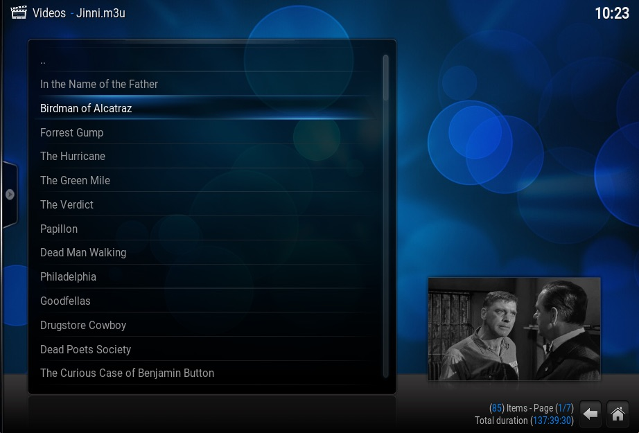

# script.jinni - a Kodi add-on to recommend similar movies


This add-on adds an entry **Jinni** to the context menu for movies in your video library.

When selected, the add-on reads the included file **jinni-links** to get a list
of all movies similar to the highlighted one. Matching is based on IMDB IDs.

Then it writes a **Jinni.m3u** playlist containing those movies which are found
in your video library, and opens the playlist so you can choose a movie to play.
The list is sorted from most-similar to least-similar, and limited to 100 entries.

All of this happens locally and offline.




The file **jinni-attrs** is provided for further improvements, but is not currently
used. It contains the attributes assigned to each movie.

For example, the movies
[The Shawshank Redemption](http://www.imdb.com/title/tt0111161)
and
[Birdman of Alcatraz](http://www.imdb.com/title/tt0055798)
have a similarity of 55% because they share the following attributes:

```
Attitudes:Realistic
Attitudes:Serious
Flag:Mild Violent Content
Genres:Drama
Genres:Period
Mood:Captivating
Mood:Sincere
Mood:Touching
Mood:Uplifting
Place:Prison
Plot:Confined
Plot:Criminal Heroes
Plot:Hopes
Plot:Human Spirit
Plot:Power Relations
Plot:Prison Life
Plot:Redemption
Praise:Award Winner
Praise:Critically Acclaimed
Time/Period:20th Century
Time/Period:40s
Time/Period:50s
```

